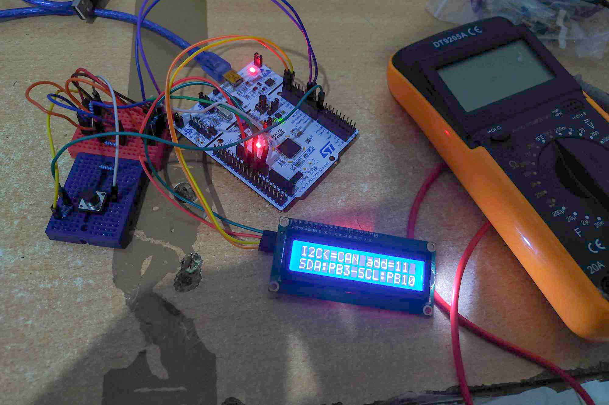
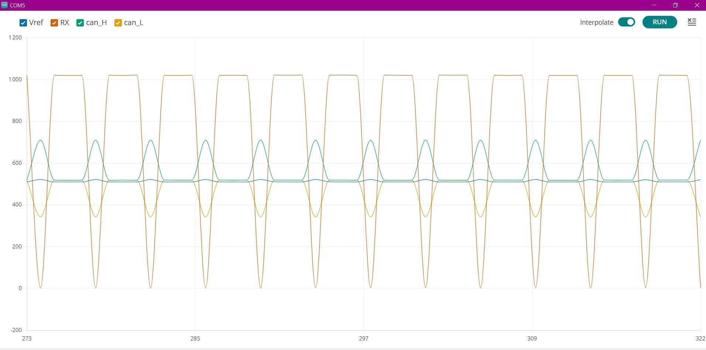

# STM32_CAN_I2C_UART_Converter

## Project Description

This project involves the development of a versatile bidirectional converter that seamlessly bridges communication between Controller Area Network (CAN), Inter-Integrated Circuit (I2C), and Universal Asynchronous Receiver-Transmitter (UART) protocols. The converter is based on the STM32 microcontroller platform, leveraging its robust capabilities to facilitate communication across these diverse standards.

## Key Features

- **Bidirectional Communication:** Enables seamless data exchange between CAN, I2C, and UART interfaces.
- **STM32 Microcontroller:** Harnesses the processing power and versatility of STM32 for efficient protocol translation.
- **Configurability:** Offers flexibility through configurable settings to adapt to specific network requirements.
- **LCD Display:** Includes an LCD display for visualizing information and selecting conversion modes.
- **Mode Selection Button:** Utilizes a button for easy and intuitive selection of the desired conversion mode.
- **Open-Source:** The project is open-source, allowing for community collaboration and further enhancements.
## Some images
# The hardware setup

# CAN tranciever testing

This bidirectional converter is designed to serve as a valuable tool for developers working in environments where CAN, I2C, and UART devices coexist, providing a bridge for seamless communication and data transfer.
